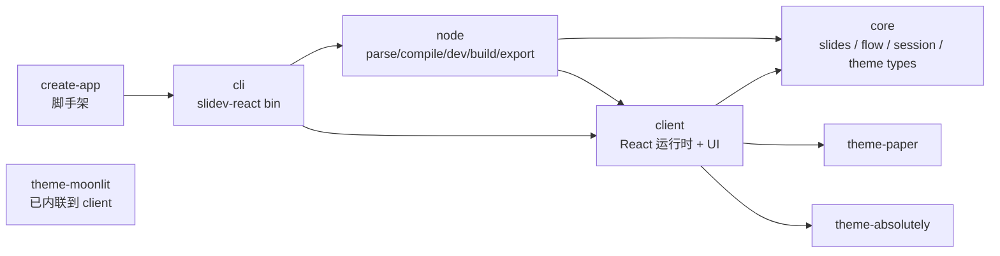

# Architecture Snapshot · 2026-04-23

> 本文档是 Phase 0 的基线产出，用来回答"当前代码长什么样"这个问题。后续每完成一个 Phase 应同步更新本快照。

---

## 1. 包依赖图



**外部契约（不可破坏）**：
- `@slidev-react/core` 的 `presentation/session/protocol` / `presentation/flow/*` / `presentation/export/urls` / `slides/*`。
- `@slidev-react/client` 的 `.` / `./runtime` / `./addons/*` / `./themes/moonlit`。
- `@slidev-react/node` 被 `cli` 和内部 dev 流程消费。

---

## 2. `packages/client/src` 子目录职责

| 目录 | 行数规模 | 职责 | 备注 |
|---|---|---|---|
| `app/` | ~125 行 | App 挂载、全局 Providers 装配、Presentation bootstrap | 合理薄壳 |
| `features/presentation/` | ~14,434 行 | 演示运行时主战场 | **Phase 1 重点拆分** |
| `theme/` | ~800 行 | 主题注册、tokens、layouts、transitions 样式 | `themeTokens.ts` 管 slide 内容 token |
| `addons/` | ~1,700 行 | builtin mermaid / g2 / insight + 动态 addon 发现 | **Phase 4 瘦身** |
| `ui/primitives/` | 437 行 | 设计系统原语（8 个） | **Phase 2 扩展** |
| `ui/tokens/` | 新增（Phase 0 起） | UI 外壳 token / 动效 / z-index / draw colors | 与 `theme/themeTokens.ts` 并列 |
| `ui/mdx/` | ~400 行 | MDX 组件（CodeMagicMove / MinimaxVisualizer） | 稳定 |
| `ui/diagrams/` | 小 | 图表 wrapper | **Phase 4 将引入 DiagramFrame** |
| `runtime/` | 小 | entry.tsx、manifest | 稳定 |

---

## 3. `features/presentation/` 结构现状

```
features/presentation/
├── PresentationStatus.tsx                   496 行  God bar
├── PrintSlidesView.tsx                      360 行
├── browser.ts / location.ts / path.ts
├── session.ts
├── types.ts                                 1 行（几乎空壳）
├── usePresentationRecorder.ts               194 行
├── recordingFilename.ts
├── exportArtifacts.ts
├── __mocks__/presentation-config.ts
├── draw/
│   ├── DrawProvider.tsx                     394 行  state+persistence+keyboard
│   ├── DrawOverlay.tsx                      170 行
│   └── persistence.ts  (+ __tests__/persistence.test.ts ✅)
├── navigation/
│   ├── KeyboardController.tsx               73 行
│   ├── keyboardShortcuts.ts                 221 行
│   ├── PresentationNavbar.tsx               162 行
│   ├── ShortcutsHelpOverlay.tsx             96 行
│   └── useSlidesNavigation.ts
├── overview/
│   ├── QuickOverview.tsx                    165 行
│   └── NotesOverview.tsx                    200 行
├── presenter/
│   ├── PresenterShell.tsx                   286 行  总线组件
│   ├── PresenterModeView.tsx                88 行
│   ├── StandaloneModeView.tsx               36 行
│   ├── PresenterSidePreview.tsx             69 行
│   ├── PresenterTopProgress.tsx             28 行
│   ├── SpeakerNotesPanel.tsx                51 行
│   ├── FlowTimelinePreview.tsx              275 行
│   ├── stage.ts
│   ├── model/{types,persistence}.ts
│   ├── platform/{useWakeLock,useFullscreen,useIdleCursor}.ts
│   └── runtime/
│       ├── usePresenterChromeRuntime.ts     358 行
│       ├── usePresenterFlowRuntime.ts       238 行
│       └── usePresenterSessionRuntime.ts    225 行
├── reveal/
│   ├── Reveal.tsx                           286 行  cue + motion
│   ├── RevealContext.tsx                    30 行
│   └── useRevealStep.ts
├── stage/
│   ├── SlideStage.tsx                       210 行
│   ├── SlidePreviewSurface.tsx              134 行
│   ├── SlideErrorBoundary.tsx               102 行
│   └── slideViewport.tsx                    47 行
└── sync/
    ├── index.ts / types.ts
    ├── model/                               协议/状态类型
    ├── adapters/
    │   ├── broadcastChannelTransport.ts     40 行
    │   └── websocketTransport.ts            128 行
    └── runtime/
        ├── usePresentationSync.ts           85 行
        ├── useSyncPresenceRuntime.ts        106 行
        ├── useSyncReplicationRuntime.ts     210 行
        └── useSyncTransportRuntime.ts       251 行
```

---

## 4. 业务 Hook 契约摘要

### `useSlidesNavigation` (navigation/)

- 输入：无显式 props（消费 `SlidesNavigationProvider` context）
- 输出：`{ currentIndex, total, goTo, prev, next }`
- 副作用：URL 路径同步（`location.ts`）

### `usePresenterFlowRuntime` (presenter/runtime/)

- 输入：`{ slides: CompiledSlide[], navigation: SlidesNavigationLike }`
- 输出：`{ currentClicks, currentClicksTotal, canPrev, canNext, revealContextValue, setSlideClicks, setSlideClicksTotal, goToSlideAtStart, advanceReveal, retreatReveal }`
- 副作用：本地 `Map` 维护 cue 步数注册表；通过 `navigation.goTo` 驱动页面切换
- ✅ 已锁单测：`__tests__/usePresenterFlowRuntime.browser.test.tsx`（3 case）

### `usePresenterChromeRuntime` (presenter/runtime/)

- 输入：`{ canControl, canOpenOverview, isPresenterRole }`
- 输出：`{ stageScale, cursorMode, hideCursor, sidebarWidth, 4 个 overlay 状态 + toggle, keyboard shortcut triggers, shortcutHelpSections }`
- 副作用：localStorage（stage scale / cursor mode / sidebar width）、`window addEventListener('keydown')`、idle cursor timer
- ⚠️ 358 行、职责最杂，Phase 3.4 重点拆分

### `usePresenterSessionRuntime` (presenter/runtime/)

- 输入：`{ slides, session, navigation, flow, canControl, slidesExportFilename, slidesTitle }`
- 输出：`{ sync, recorder, remoteCursor, localCursor, setLocalCursor, localTimer, remoteTimer, onStrokesChange, remoteDrawings, detachFromPresenter }`
- 副作用：presentation sync、recorder、cursor broadcasting、session timer
- 依赖：`usePresentationSync`、`usePresentationRecorder`

### `usePresentationSync` (sync/runtime/)

- 协调 `useSyncTransportRuntime` / `useSyncPresenceRuntime` / `useSyncReplicationRuntime`
- ✅ 有 browser 测试（`usePresentationSync.browser.test.tsx` 421 行）

### Draw Provider

- 不是 hook 但承担 state 管理：reducer 逻辑、localStorage、键盘事件三合一。Phase 3.1 拆分目标。

---

## 5. UI 原语清单（Phase 0 结束时）

| 原语 | 行数 | 是否 Phase 2 扩展对象 |
|---|---|---|
| `ChromeIconButton` | 58 | ✅ 已广泛使用 |
| `ChromePanel` | 79 | ✅ 稳定 |
| `ChromeTag` | 70 | ✅ 稳定 |
| `FormSelect` | 51 | ⚠️ 部分场景可替换为 `ChromeToggleGroup`（Phase 2 新增） |
| `Annotate` | 82 | 与 reveal 深度耦合，保持独立 |
| `Callout` | 24 | 稳定 |
| `Badge` | 9 | 稳定 |
| **待新增** | | |
| `ChromeButton` | — | Phase 2 新增（文字+图标按钮） |
| `ChromeToggleGroup` | — | Phase 2 新增（分段控件） |
| `OverlayShell` | — | Phase 2 新增（三个 overlay 骨架统一） |

---

## 6. `ui/tokens/` 现状（Phase 0 引入）

```
packages/client/src/ui/tokens/
├── motion.ts          MOTION_DURATION{fast=120, base=180, slow=240} + MOTION_EASING{out, inOut}
├── layers.ts          Z_LAYERS{stage, slideChrome=10, timeline=30, navbar=40, overlay=50, toast=60, debug=90}
├── drawTokens.ts      DRAW_COLORS / DRAW_WIDTHS / STAGE_SCALE_OPTIONS / CURSOR_MODE_OPTIONS
├── chromeTokens.ts    CHROME_TONE{surface, border, fg, accent, ...} + CHROME_RADIUS{sm=4, md=6, lg=8, full=9999}
└── index.ts           统一出口
```

**已消费方**：`PresentationStatus.tsx`（DRAW_COLORS、DRAW_WIDTHS）。

**扩散计划**：
- Phase 2.4 将 `StatusDetailsPanel` 中 `STAGE_SCALE_OPTIONS` / `CURSOR_MODE_OPTIONS` 改从 tokens 读。
- Phase 5.3 将 UI 外壳中的 `bg-slate-*` / `text-slate-*` 改映射到 `CHROME_TONE`（需要 Tailwind v4 `@theme` 或 CSS 变量桥接）。

---

## 7. 工程状态

### 测试

- 单测项目（`pnpm test --project=unit`）：**181 测试通过 / 35 文件通过**；另有 **12 测试文件 import 层错误**（pre-existing）：
  - 错误形式：`Vitest failed to find the current suite`
  - 根因推测：`vite-plus/test` 与 `vitest` 两个包在 `node_modules` 同时出现了不同版本（0.1.11 与 0.1.12），afterEach 等全局 API 绑定到了错误的 suite runner
  - 不在 Phase 0 范围。建议留给后续工具链升级 PR 单独处理。
- 浏览器测试项目（`pnpm test --project=browser`）：**19 测试通过 / 9 文件通过**（Phase 0 补了 `usePresenterFlowRuntime.browser.test.tsx` 3 case）。

### Lint

- Oxlint + 类型感知：**0 warnings, 0 errors**（Phase 0 结束态）。
- 尚无 import 边界规则。建议 Phase 1 在 `.oxlintrc` 增加 `no-restricted-imports` 防止 `ui/primitives` 反向依赖 `features/*`。

### 命名规约现状（待 Phase 3 统一）

- 组件：PascalCase ✅
- Hook：`use*` ✅，但无 `useXxxState` / `useXxxRuntime` / `useXxxSelector` 分层
- 文件：PascalCase 组件 / camelCase 辅助 ✅

---

## 8. 已知热点与痛点索引

| 热点 | 位置 | Phase 对策 |
|---|---|---|
| `PresentationStatus` 一文 13 区域 | `features/presentation/PresentationStatus.tsx` | Phase 1 PR#2-#3 拆 6 份 |
| `PresenterShell` 8 props + 6 runtime | `features/presentation/presenter/PresenterShell.tsx` | Phase 1 PR#1（`PresenterContext` + `PresentationRoot`） |
| `DrawProvider` 键盘事件抢占 | `draw/DrawProvider.tsx:242-306` | Phase 1.5 |
| `DrawProvider` 394 行 3 合 1 | `draw/DrawProvider.tsx` | Phase 3.1 拆 reducer + persistence + remote |
| `usePresenterChromeRuntime` 358 行 | `presenter/runtime/usePresenterChromeRuntime.ts` | Phase 3.4 拆 4 个子 hook |
| `Reveal.tsx` 286 行 cue + motion | `reveal/Reveal.tsx` | Phase 3.2 抽 `revealEngine` |
| `MermaidDiagram` 589 / `G2Chart` 445 | `addons/builtin/{mermaid,g2}/` | Phase 4 抽 `DiagramFrame` |
| 三个 Overlay 骨架不一 | `ShortcutsHelpOverlay` / `QuickOverview` / `NotesOverview` | Phase 2 `OverlayShell` |
| `PresentationNavbar` vs `PresentationStatus` 按钮重复 | 两处 | Phase 2 共用 `ChromeButton` / `ChromeIconButton` |
| `vite-plus/test` 双版本 | 根 `node_modules` | 脱离本次重构，单独 PR |
