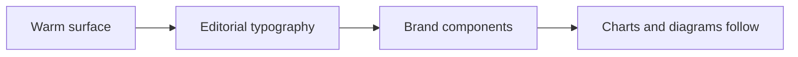

<Eyebrow>Absolutely Theme</Eyebrow>

# A warm, editorial deck system for narrative talks

This smoke deck exercises the `Absolutely` theme package without changing the repository's default demo.

<Badge>Light-first</Badge>

---

title: Chapter
layout: section

---

<Eyebrow>Section</Eyebrow>

# The deck should feel edited, not decorated

One accent, one thesis, and enough restraint to let the story breathe.

---

title: Brand Surface
layout: default

---

  

    <Eyebrow>Components</Eyebrow>
    <PullQuote by="Absolutely" meta="theme brand component">
      Good presentation themes create pacing and tone before they create decoration.
    </PullQuote>

    <Callout title="What this proves">
      The theme overrides high-frequency MDX primitives and introduces a few brand components without forcing a new authoring model.
    </Callout>

  

  

    <KeyStat value="78%" label="Retention lift" detail="Compared with the previous deck style in an internal dry run." />
    <KeyStat value="3" label="Brand components" detail="Eyebrow, KeyStat, and PullQuote are enough for a strong first version." />
  

<Insight title="Insight">
  Insight inherits the active theme palette too, so side-notes no longer snap back to the default
  cyan styling.
</Insight>

---

title: Addon Sync
layout: default

---

  

  

  

<BarChart
  size="half"
  data={[
    { label: "Story", value: 78 },
    { label: "Density", value: 61 },
    { label: "Clarity", value: 84 },
  ]}
  x="label"
  y="value"
/>

  

---

title: Statement
layout: statement

---

# A themed deck should stay coherent even when charts, diagrams, and notes appear.
