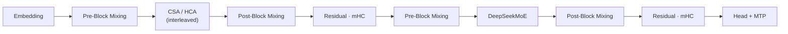
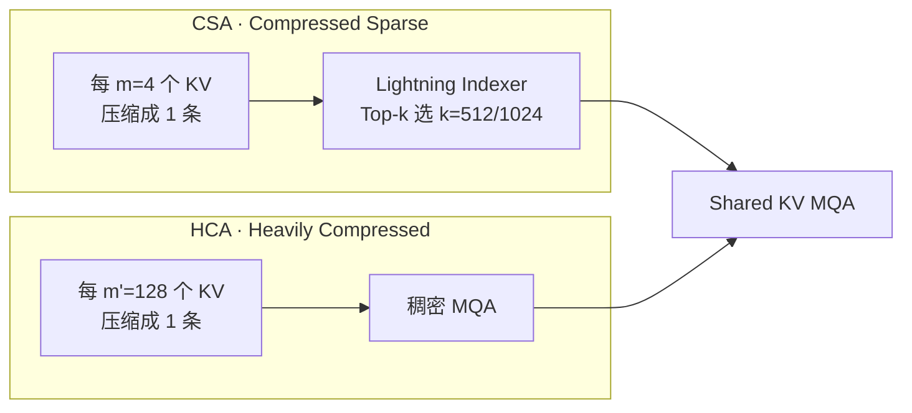
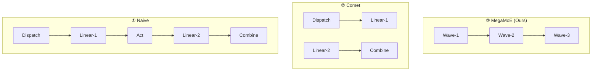
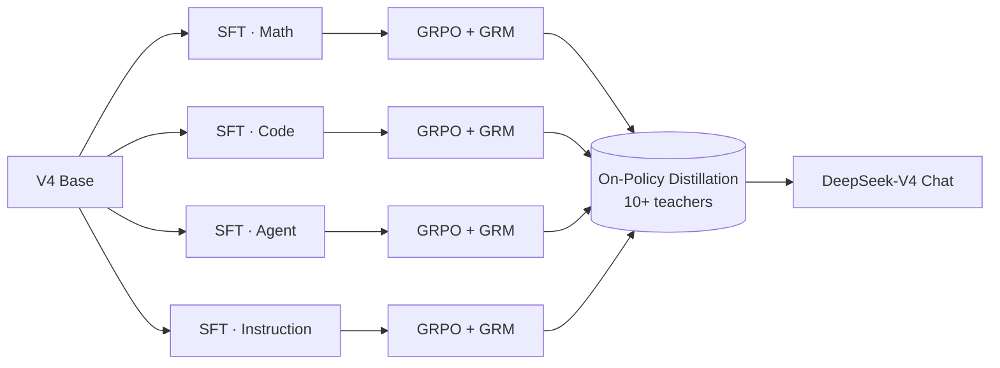

<Eyebrow>Paper Walkthrough</Eyebrow>

# DeepSeek-V4

### 通往百万 Token 的效率之路

从 Hybrid Attention、mHC、Muon 到 On-Policy Distillation —— 用一份长 deck，把这篇 55 页的预览版技术报告逐层拆开。

<Badge>Preview Release</Badge>

<div style={{ position: "absolute", bottom: "12px", right: "16px", fontSize: "11px", lineHeight: 1.2, opacity: 0.5, letterSpacing: "0.02em", whiteSpace: "nowrap", display: "block" }}><span style={{ fontSize: "inherit", display: "inline" }}>Generated by <a href="https://github.com/hylarucoder/slidev-react" target="_blank" rel="noopener noreferrer" style={{ fontSize: "inherit", display: "inline", textDecoration: "underline", textUnderlineOffset: "2px" }}>slidev-react</a> · Last updated 2026-04-24</span></div>

---

title: 开场
layout: statement

---

# 百万 Token，不再是目的地，而是新的地板。

---

title: 一 · 为什么是 V4
layout: section

---

<Eyebrow>Chapter 01</Eyebrow>

# 为什么需要一代"效率导向"的新旗舰

推理模型把 test-time scaling 推到了极限，而 vanilla attention 的二次复杂度，正在把长链条推理按在地上。

---

title: Test-time Scaling 的瓶颈
layout: default

---

<div className="grid gap-10 md:grid-cols-[minmax(0,1fr)_minmax(0,1fr)]">
  <div>
    <Eyebrow>The bottleneck</Eyebrow>

### 三种需求同时发生

- **Reasoning Models** 需要更长的思考序列
- **Agentic Workflows** 要跨越十几轮工具调用
- **Long-horizon Docs** 把跨文档分析推入百万 token

传统注意力是 *O(n²)*。哪怕只是把上下文从 128K 拉到 1M，计算成本也翻 64 倍——于是"能思考多久"这件事，直接被 FLOPs 预算掐死。

</div>

  <div>
    <Callout title="V4 的命题">
      不是"更聪明一点点"，而是**在同样预算下，把上下文和思考链条扩大一个数量级**。架构、优化器、基础设施，要一起重写。
    </Callout>
</div>
</div>

---

title: 三个赌注
layout: default

---

<Eyebrow>Three bets</Eyebrow>

# V4 把筹码押在三件事上

<div className="grid gap-6 md:grid-cols-3">
  <div>

### ① Hybrid Attention

`CSA + HCA` 交替堆叠：**沿序列维度先压缩，再稀疏注意**。核心 KV Cache 收敛到基线的 2%。

</div>

  <div>

### ② mHC 残差连接

Manifold-Constrained Hyper-Connections：把扩宽的残差矩阵约束在 Birkhoff 多胞形上，让深层堆叠不再炸飞。

</div>

  <div>

### ③ Muon 优化器

用 Nesterov + Newton–Schulz 正交化替代 AdamW 的 element-wise 思路，**收敛更快、训练更稳**。

</div>
</div>

<Insight title="一句话总结">
  V4 不是"换个更大模型"，它是**一次以效率为唯一 KPI 的系统工程**——从 loss 函数到磁盘缓存，全栈重排。
</Insight>

---

title: 两款模型
layout: default

---

<Eyebrow>Models</Eyebrow>

# 一次发布，两款 MoE

<div className="grid gap-6 md:grid-cols-2">
  <KeyStat value="1.6T" label="DeepSeek-V4-Pro" detail="总参数 1.6 万亿，每 token 激活 49B。训练 33T tokens，目标：开源模型的新 SOTA。" />
  <KeyStat value="284B" label="DeepSeek-V4-Flash" detail="总参数 284B，每 token 激活 13B。训练 32T tokens，目标：用最小代价吃下 1M 上下文。" />
</div>

<div className="mt-6 grid gap-4 md:grid-cols-3">
  <KeyStat value="1M" label="原生上下文长度" detail="预训练阶段从 4K → 16K → 64K → 1M 四段式扩展。" />
  <KeyStat value="128K" label="词表大小" detail="沿用 V3 分词器，仅引入少量工具调用专用 token。" />
  <KeyStat value="MTP=1" label="Multi-Token Prediction" detail="继承 V3 的 MTP 模块，深度固定 1。" />
</div>

---

title: 效率全景
layout: default

---

<Eyebrow>Efficiency at a glance</Eyebrow>

# 在 1M 上下文下的三张对比表

<div className="grid gap-8 md:grid-cols-[minmax(0,1.2fr)_minmax(0,0.8fr)]">
  <div>

<BarChart
  size="half"
  data={[
    { metric: "单 token FLOPs (V4-Pro)", value: 27 },
    { metric: "单 token FLOPs (V4-Flash)", value: 10 },
    { metric: "KV Cache (V4-Pro)", value: 10 },
    { metric: "KV Cache (V4-Flash)", value: 7 },
  ]}
  x="metric"
  y="value"
/>

以 DeepSeek-V3.2 为基线 (=100%)。V4-Flash 把单 token 推理 FLOPs 降到 10%，KV Cache 降到 7%。

</div>

  <div>
    <Callout title="为什么还能更快">
      - 路由专家权重跑 **FP4**
      - Lightning Indexer 的 QK 路径 **FP4**
      - RoPE 维度 **BF16**，其余 **FP8**
      - KV Cache 混合精度存储，体积再砍半
    </Callout>
</div>
</div>

---

title: 效率 Statement
layout: statement

---

# 同等 1M 上下文，V4-Flash 只需要 V3.2 约 **10%** 的推理 FLOPs。

---

title: 二 · 架构革新
layout: section

---

<Eyebrow>Chapter 02</Eyebrow>

# 架构：在 V3 的地基上，做三处关键换件

保留 DeepSeekMoE、MTP、DeepSeek-V3 的全部默认配置；只在"让长文更省、让深层更稳"的位置下手。

---

title: 总览架构
layout: default

---

<Eyebrow>Figure 2 · Overall</Eyebrow>

# 一个 Transformer Block 的样子



<Callout title="三个替换点">
  **①** 残差连接 → *m*HC；**②** 稠密 Attention → CSA / HCA 交错；**③** 优化器 → Muon（多数参数）+ AdamW（少数）。
</Callout>

---

title: MoE 小调整
layout: default

---

<Eyebrow>DeepSeekMoE</Eyebrow>

# 从 V3 继承，但改了两处细节

<div className="grid gap-8 md:grid-cols-2">
  <div>

### 路由打分

把亲和度打分函数从 **Sigmoid(·)** 换成 **Sqrt(Softplus(·))**；辅助无损失负载均衡基本沿用，再叠一层很轻的 sequence-wise balance loss 防极端不均衡。

### 前几层的 Hash 路由

V4 把前 3 层 MoE 的路由直接换成 **Hash Routing**（按 token ID hash 定专家），稳定性换一点表达力。

</div>

  <div>

### 参数规模

- **V4-Flash**：1 shared + 256 routed experts，中间维度 2048，每 token 激活 6 个 routed experts
- **V4-Pro**：1 shared + 384 routed experts，中间维度 3072，同样激活 6 个

取消了 V3 里"每 token 最多路由到多少节点"的限制，换回更灵活的并行策略。

</div>
</div>

---

title: mHC 介绍
layout: default

---

<Eyebrow>Residual · mHC</Eyebrow>

# 让残差连接长得更"稳"

<div className="grid gap-10 md:grid-cols-[minmax(0,1fr)_minmax(0,1fr)]">
  <div>

标准 Hyper-Connection（HC）把残差流从 `ℝ^d` 扩展到 `ℝ^{n_hc × d}`，用三个线性映射 `A, B, C` 控制读写：

```
X_{l+1} = B_l · X_l + C_l · F_l(A_l · X_l)
```

宽度解耦带来表达力，但**堆深了就爆**——数值不稳、loss 偶发抖动。

</div>

  <div>
    <PullQuote by="DeepSeek-V4" meta="Manifold-Constrained HC">
  We constrain the residual mapping onto the manifold of doubly stochastic matrices, so the spectral norm is bounded by 1.
</PullQuote>
</div>
</div>

---

title: mHC 约束
layout: default

---

<Eyebrow>Math behind mHC</Eyebrow>

# 三件事把 HC 装进"Birkhoff 多胞形"

<div className="grid gap-6 md:grid-cols-3">
  <div>

### ① Residual Mapping

`B_l ∈ M`，其中 `M` 是**双随机矩阵集合**（行和列和均为 1）。谱范数天然 ≤ 1，层层叠加不会发散。

</div>

  <div>

### ② Input / Output

`A_l, C_l` 用 `σ(·)` 约束到非负且有界，避免信号相消。

</div>

  <div>

### ③ Sinkhorn-Knopp

对原始参数 `B̃_l` 做 20 次行列归一化迭代，投影到 `M`。前后向都只多了一点常数开销。

</div>
</div>

<Insight title="工程收益">
  `m`HC 模块训练墙上开销只占 1F1B pipeline stage 的 **6.7%**，但把深层训练的 loss spike 频率压到了可以忽略的水平。
</Insight>

---

title: mHC 小结
layout: statement

---

# 把残差约束在"双随机矩阵"上，就是把爆炸概率乘以零。

---

title: 混合 Attention 总览
layout: default

---

<Eyebrow>Hybrid Attention</Eyebrow>

# CSA × HCA：一张"压缩 + 稀疏"的组合拳



<div className="grid gap-4 md:grid-cols-3 mt-6">
  <KeyStat value="m = 4" label="CSA 压缩率" detail="先压缩，再在压缩块上做 DSA 稀疏注意。" />
  <KeyStat value="m' = 128" label="HCA 压缩率" detail="极致压缩，但保持稠密注意力。" />
  <KeyStat value="n_win = 128" label="Sliding Window" detail="额外一条未压缩滑窗分支，兜底局部细粒度依赖。" />
</div>

---

title: CSA 细节
layout: default

---

<Eyebrow>CSA · Compressed Sparse Attention</Eyebrow>

# 压缩之后再稀疏：两段论

<div className="grid gap-10 md:grid-cols-[minmax(0,1.1fr)_minmax(0,0.9fr)]">
  <div>

### 第一段 · Token-Level Compressor

对每 *m* 个 token 的 KV，用 softmax 加权合并成 1 条压缩条目。`C^a / C^b` 两条互相重叠，保持上下文连续。

### 第二段 · Lightning Indexer

- 用低秩 query `q^I` 和压缩 KV 的 `K^ICᵒᵐᵖ` 算 index score
- Top-k 选择 **k=512 (Flash) / 1024 (Pro)** 条压缩条目
- 最后对选中的条目跑 **Shared-KV MQA**

### 为什么这么设计

> "压缩"消灭了序列维度的冗余；"稀疏"让查询只看少数相关块。两者合起来，长度从 n 变成了 k，和 1M 没关系。

</div>

  <div>
    <Callout title="一些隐藏小技巧">
      - **Grouped Output Projection**：把 n_h 个输出分 g=8/16 组投影，砍掉一大块 attn-out 计算量
      - **Partial RoPE**：只对 last 64 维做 RoPE，并用位置 `-i` 给 output 补齐相对位置
      - **Attention Sink**：每个 head 学一个 sink logit，允许总权重不等于 1
    </Callout>
</div>
</div>

---

title: HCA 细节
layout: default

---

<Eyebrow>HCA · Heavily Compressed Attention</Eyebrow>

# HCA = "别稀疏，但压得更狠"

<div className="grid gap-8 md:grid-cols-2">
  <div>

### 核心差异

- 压缩率 **m' = 128**，远大于 CSA 的 4
- 压缩块之间**不重叠**
- 完全不做稀疏选择，直接稠密 attention

### 存在的理由

序列维度已经砍到 1/128，再稀疏反而得不偿失。HCA 的定位是：**提供全局 long-range 信息，作为 CSA 的"骨架"**。

</div>

  <div>
    <Insight title="CSA 与 HCA 的分工">
      - **CSA**：细致但稀疏 —— 负责"近景清楚"
      - **HCA**：粗糙但全局 —— 负责"远景仍在"
      - 两者按层交错，配 128 token 的滑窗分支，最终在 1M 上把 KV Cache 打到 BF16 GQA8 基线的约 **2%**。
    </Insight>
</div>
</div>

---

title: Muon 优化器
layout: default

---

<Eyebrow>Muon Optimizer</Eyebrow>

# 用正交化取代逐元素：训练更快也更稳

<div className="grid gap-8 md:grid-cols-2">
  <div>

### 核心流程

```
G_t  = ∇W L(W_{t-1})
M_t  = μ M_{t-1} + G_t        # Nesterov
O'_t = HybridNewtonSchulz(μ M + G)   # 正交化
O_t  = O'_t · √max(n, m) · γ  # rescale RMS
W_t  = W_{t-1}(1-ηλ) - η O_t  # weight decay
```

### 混合 Newton–Schulz

- 前 8 步用激进系数 `(3.4445, -4.7750, 2.0315)` 收敛
- 后 2 步换温和系数 `(2, -1.5, 0.5)` 稳定到 1

</div>

<div>

<Callout title="哪些参数用 Muon">
  **Muon**：绝大多数权重矩阵

  **AdamW**：Embedding、Prediction Head、静态 bias / gate、mHC、所有 RMSNorm

  因为 attention 架构天然支持 QK 的 RMSNorm，Muon 里**不再需要** QK-Clip，去掉了一层手动的数值保险丝。
</Callout>

</div>
</div>

---

title: 架构收尾
layout: statement

---

# 架构的每一次折叠，都是在给"百万 token"腾路。

---

title: 三 · 基础设施
layout: section

---

<Eyebrow>Chapter 03</Eyebrow>

# 基础设施：模型之外的另一半工作量

六件事，全部为了让 V4 训得动、推得快、结果可复现。

---

title: MegaMoE EP Overlap
layout: default

---

<Eyebrow>Expert Parallelism</Eyebrow>

# 把通信藏在计算下面：MegaMoE



把专家切成 "波次"（waves）。当前 wave 计算、下一 wave token 传输、上一 wave 结果回传，**三件事并发进行**。

<div className="grid gap-4 md:grid-cols-3 mt-6">
  <KeyStat value="1.92×" label="理论加速比" detail="相对于 Naive 的融合 MoE kernel。" />
  <KeyStat value="1.96×" label="RL Rollout 场景" detail="延迟敏感的长尾 batch 下的实际加速。" />
  <KeyStat value="6144" label="FLOPs / Byte" detail="V4-Pro 下的计算/通信比阈值，超过即可完全隐藏通信。" />
</div>

---

title: TileLang
layout: default

---

<Eyebrow>TileLang · DSL</Eyebrow>

# 替掉几百个 Torch ATen 算子

<div className="grid gap-8 md:grid-cols-2">
  <div>

### 三板斧

- **Host Codegen**：把 Python 侧 dispatch 下沉到生成的 C++，单次调用开销从几十 µs 降到 **< 1 µs**
- **Z3 SMT 辅助整数分析**：在编译期验证向量化、barrier 插入的安全性
- **IEEE 严格语义开关**：默认关 fast-math，需要位一致时切 `T.ieee_fsqrt / T.ieee_fdiv`

</div>

  <div>
    <PullQuote by="DeepSeek Infra Team" meta="TileLang co-design">
  我们宁可让编译期多花几秒，也要保证训练、推理、post-training 的 kernel 在 bit 级可对齐。
</PullQuote>
</div>
</div>

---

title: 确定性 Kernels
layout: default

---

<Eyebrow>Batch-Invariant & Deterministic</Eyebrow>

# 三个被重写的"默认做法"

<div className="grid gap-6 md:grid-cols-3">
  <div>

### Attention

放弃 **Split-KV**，改为 *dual-kernel*：
- Kernel 1：一个 SM 处理一整条 sequence
- Kernel 2：多 SM 仅处理尾部 wave
- 用 distributed shared memory 串起来

</div>

  <div>

### MatMul

cuBLAS 不是 batch-invariant，改用 **DeepGEMM**；小 batch 放弃 split-k，用自研优化覆盖性能回退。

</div>

  <div>

### Backward

用 **per-SM 累加桶 + 全局确定性求和** 替掉 `atomicAdd`，确保 MoE backward、Sparse Attention backward 完全可复现。

</div>
</div>

<Insight title="为什么如此执着">
  Loss spike 的根因调试、分歧实验的对齐、Post-training 对 Base 模型的 bit-level 复用——没有 determinism，这一切都要靠"重跑几次猜一猜"。
</Insight>

---

title: FP4 QAT
layout: default

---

<Eyebrow>FP4 Quantization-Aware Training</Eyebrow>

# 把两块最贵的部件压到 4 bit

<div className="grid gap-10 md:grid-cols-[minmax(0,1fr)_minmax(0,1fr)]">
  <div>

### 两个量化目标

- **MoE 专家权重**：GPU 显存占用大头
- **CSA Lightning Indexer 的 QK 路径**：长上下文下 attention score 的计算热点

FP4 (E2M1) → FP8 (E4M3) 的反量化在现有权重范围内是 **无损的**（通过 per-block scale 验证）。

</div>

  <div>
    <div className="grid gap-4">
      <KeyStat value="2×" label="Top-k Selector 加速" detail="Indexer 的 QK 路径全 FP4 后的端到端加速。" />
      <KeyStat value="99.7%" label="KV 条目召回率" detail="FP4 indexer 相对 FP32 的 top-k 命中率。" />
    </div>
</div>
</div>

---

title: 训练框架
layout: default

---

<Eyebrow>Training Framework</Eyebrow>

# 四件在 V3 基础上的增量

<div className="grid gap-6 md:grid-cols-2">
  <Callout title="① Muon × ZeRO">
    Muon 需要完整梯度矩阵，与 ZeRO 冲突。用背包算法做 ZeRO bucket 分配；DP 超出 ZeRO 并行度时，多出的组冗余算 Muon 更新，用算力换显存。
  </Callout>
  <Callout title="② mHC 节省">
    融合 kernel + 选择性重算。保留大多数 hidden states，仅避开计算密集部分。调整 DualPipe 1F1B 让 mHC 的额外通信能并发。
  </Callout>
  <Callout title="③ Contextual Parallelism">
    两阶段通信：先给邻居传 m 条未压缩 KV，再做所有 CP rank 的 all-gather + select-and-pad，修好压缩边界。
  </Callout>
  <Callout title="④ Tensor-level Checkpointing">
    基于 TorchFX，用户只需注解"重算哪些 tensor"。框架反向遍历图，自动构建最小重算子图。
  </Callout>
</div>

---

title: 推理框架
layout: default

---

<Eyebrow>Inference · KV Cache</Eyebrow>

# 把异构 KV Cache 当一等公民设计

<div className="grid gap-10 md:grid-cols-[minmax(0,1fr)_minmax(0,1fr)]">
  <div>

### 两层缓存

- **State Cache**：SWA 的未压缩 KV + 还没攒够的 tail tokens
- **KV Cache**：CSA / HCA 的压缩块，按 `lcm(m, m')` 对齐

### 磁盘三策略

- **Full SWA Caching**：零重算，写入密集
- **Periodic Checkpointing**：按 p 周期打点，存储/计算可调
- **Zero SWA Caching**：只存压缩块，用 `n_win · L` token 重算恢复

</div>

  <div>
    <Insight title="为什么不能直接用 PagedAttention">
      - SWA 的 eviction 策略和主 attention 冲突
      - 稀疏 attention kernel 对 block 对齐有硬要求
      - → 重新设计 block 结构，才是唯一可行解。
    </Insight>
</div>
</div>

---

title: 四 · 预训练
layout: section

---

<Eyebrow>Chapter 04</Eyebrow>

# 预训练：32T Tokens 里挑出来的"新口粮"

数据升级的三个重点：反模板化、强化 Agentic 语料、学术长文优先。

---

title: 数据构成
layout: default

---

<Eyebrow>Data Construction</Eyebrow>

# 比 V3 做得更细的四件事

<div className="grid gap-6 md:grid-cols-2">
  <Callout title="反模板化">
    专门识别并过滤"批量自动生成 / 模板复制"的 web 文本，规避 *model collapse*。
  </Callout>
  <Callout title="Agentic 数据">
    mid-training 阶段显式注入 agent 交互轨迹，为后续工具调用能力打底。
  </Callout>
  <Callout title="多语种扩容">
    扩大多语种语料，目标是"长尾文化"的知识覆盖。
  </Callout>
  <Callout title="学术长文优先">
    重点收录科研论文、技术报告；按文档拼包减少截断，同时启用 **sample-level attention masking**。
  </Callout>
</div>

<div className="mt-6 grid gap-4 md:grid-cols-3">
  <KeyStat value="32T+" label="预训练语料" detail="数学、代码、网页、长文等多类别。" />
  <KeyStat value="4 段式" label="上下文扩展" detail="4K → 16K → 64K → 1M。" />
  <KeyStat value="2 stage" label="稀疏注意上线" detail="先 1T token 的稠密 warmup，再切 sparse。" />
</div>

---

title: Flash vs Pro 超参
layout: default

---

<Eyebrow>Model Setups</Eyebrow>

# 同一套模板，两种体型

| | **V4-Flash** | **V4-Pro** |
|---|---|---|
| Transformer Layers | 43 | 61 |
| Hidden Dim `d` | 4096 | 7168 |
| Query Heads `n_h` | 64 | 128 |
| Head Dim `c` | 512 | 512 |
| MoE Experts (routed) | 256 | 384 |
| Expert FFN | 2048 | 3072 |
| Indexer Top-k | 512 | 1024 |
| Total / Activated | 284B / 13B | 1.6T / 49B |
| Train Tokens | 32T | 33T |

<Insight title="共同点">
  前两层 pure Sliding Window、前三层 MoE 用 Hash Routing、`m=4 / m'=128`、滑窗 `n_win=128`、MTP depth=1、`n_hc=4`、Sinkhorn-Knopp `t_max=20`。
</Insight>

---

title: 训练稳定性
layout: default

---

<Eyebrow>Instability Mitigation</Eyebrow>

# 两个意外好用的"土办法"

<div className="grid gap-8 md:grid-cols-2">
  <div>

### Anticipatory Routing

Loss spike 的根子在 MoE 的 *outlier 路由* 自我强化。
- **时间错位**：用 `θ_{t-Δt}` 计算路由，`θ_t` 计算特征
- 检测到 spike 才临时激活，过一段再切回
- 额外 wall-clock 开销 ≈ **20%** 且只在少数时段

</div>

  <div>

### SwiGLU Clamping

经验性地把 SwiGLU 的线性分量裁到 `[-10, 10]`，gate 上界也压到 10。
- 实测能**显著削弱 outlier**
- 对最终性能没有可观测的副作用

</div>
</div>

<PullQuote by="DeepSeek-V4 Paper" meta="§ 4.2.3">
  尽管我们还没有完整理论能解释这两招为何奏效，但我们选择开放分享，希望社区一起破解。
</PullQuote>

---

title: Base 模型评测
layout: default

---

<Eyebrow>Base Benchmarks · Table 1</Eyebrow>

# Base 模型横评：V4-Flash 就已压过 V3.2

<div className="grid gap-8 md:grid-cols-[minmax(0,1fr)_minmax(0,1fr)]">
  <div>

<BarChart
  size="half"
  data={[
    { bench: "MMLU", V3: 87.8, Flash: 88.7, Pro: 90.1 },
    { bench: "MMLU-Pro", V3: 65.5, Flash: 68.3, Pro: 73.5 },
    { bench: "C-Eval", V3: 90.4, Flash: 92.1, Pro: 93.1 },
    { bench: "GSM8K", V3: 91.1, Flash: 90.8, Pro: 92.6 },
    { bench: "LongBench-V2", V3: 40.2, Flash: 44.7, Pro: 51.5 },
  ]}
  x="bench"
  y="Pro"
/>

</div>

  <div>
    <Callout title="三点速读">
      - **Flash-Base** 以 1/2 的激活参数量反超 V3.2-Base 的多数任务
      - **Pro-Base** 在 TriviaQA、FACTS Parametric、MultiLoKo 等世界知识项上拉开 5–35 分
      - **LongBench-V2**：V3.2 40.2 → V4-Pro 51.5，长文阅读质变
    </Callout>
</div>
</div>

---

title: 预训练小结
layout: statement

---

# Base 模型的胜负已分；接下来是谁更懂"自我训练"。

---

title: 五 · 后训练
layout: section

---

<Eyebrow>Chapter 05</Eyebrow>

# 后训练：把"混合 RL"整段换成 On-Policy Distillation

V4 保留了 V3.2 的专才训练，但**合并阶段**不再是 mixed RL，而是 OPD。

---

title: Post-training Pipeline
layout: default

---

<Eyebrow>Two-stage Post-training</Eyebrow>

# 先培养多位"专才"，再用学生蒸出"通才"



<Insight title="一行话总结">
  *"分头突破，再用 OPD 把专家的分布合并到一个学生里。"* ——相比 weight-merging 或 mixed RL，OPD 不会彼此相消。
</Insight>

---

title: 推理努力模式
layout: default

---

<Eyebrow>Reasoning Effort Modes</Eyebrow>

# 把"想多久"变成 API 级别的选择

| 模式 | 何时用 | 响应格式 |
|---|---|---|
| **Non-think** | 日常轻问题、实时交互 | `</think>` summary |
| **Think High** | 复杂推理、规划、中高风险决策 | `<think> ... </think>` + summary |
| **Think Max** | 极限推理，顶格思考 | System prompt 注入 + `<think>` 全量输出 |

<Callout title="Think Max 注入了什么">
  Reasoning Effort: Absolute maximum. You MUST be thorough, decompose to root causes, stress-test your logic against edge cases and adversarial scenarios, explicitly write every intermediate step and rejected hypothesis.
</Callout>

---

title: GRM
layout: default

---

<Eyebrow>Generative Reward Model</Eyebrow>

# 把奖励模型和主模型合二为一

<div className="grid gap-10 md:grid-cols-[minmax(0,1fr)_minmax(0,1fr)]">
  <div>

### 经典 RLHF 的做法

训练一个独立的 scalar reward model，再用它指导策略优化——需要大量人工标注，容易 reward hacking。

### V4 的新写法

- 对 hard-to-verify 任务，用 **rubric-guided RL** + **GRM** 来打分
- **GRM 本身就是 actor**：主模型同时生成答案、评估答案
- 用很少的人工标注也能得到稳定评分，因为"模型自己的推理能力"被重用作为打分能力

</div>

  <div>
    <PullQuote by="DeepSeek-V4" meta="§ 5.1.1 Generative Reward Model">
  By unifying these roles, the model's internal reasoning capabilities are inherently fused into its evaluative process, resulting in highly robust scoring.
</PullQuote>
</div>
</div>

---

title: OPD 解释
layout: default

---

<Eyebrow>On-Policy Distillation</Eyebrow>

# OPD = 学生自己走路，老师在旁边指正

<div className="grid gap-8 md:grid-cols-2">
  <div>

### 目标函数

```
L_OPD(θ) = Σ w_i · D_KL( π_θ ‖ π_{E_i} )
```

- 学生 **π_θ** 自己采样轨迹（on-policy）
- 在同样的序列上，按专家 `E_i` 的权重 `w_i` 聚合 reverse-KL
- **Full-vocabulary logits**，不是 token-level 估计

### 相比 mixed RL

- 不会被多个奖励信号相互拉扯
- 更稳定的梯度估计
- 一个 student，多位 teacher（> 10）——知识密度更高

</div>

  <div>
    <Callout title="工程上的代价">
      - 10+ teacher，每个 trillion 级参数
      - 所有 teacher 权重 **offload 到中心化存储**，按需拉起
      - 缓存老师最后一层 hidden states，运行时再接 prediction head 还原 logits
      - 自研 TileLang kernel 算 exact KL
    </Callout>
</div>
</div>

---

title: 基础设施 · RL/OPD
layout: default

---

<Eyebrow>Serving the Post-train</Eyebrow>

# 让 1M token 的 RL 跑起来的四件事

<div className="grid gap-6 md:grid-cols-2">
  <Callout title="FP4 全流程">
    Rollout / reference forward / teacher forward 全走原生 FP4；只在训练 forward 用"FP4→FP8 无损反量化"走回 FP8 主路。
  </Callout>
  <Callout title="Token-level WAL">
    每生成一个 token 就写一次 write-ahead log；抢占或硬件故障后，用 WAL + KV cache 无损续跑，避免"重生成带来的长度偏差"。
  </Callout>
  <Callout title="数据格式分层">
    元数据轻量常驻、per-token 重字段走 shared-memory；on-device mini-batch 动态调度，显存和吞吐兼顾。
  </Callout>
  <Callout title="DeepSeek Elastic Compute (DSec)">
    FunctionCall / Container / microVM / fullVM 四种执行衬底 + 单一 Python SDK。3FS + EROFS + overlaybd，毫秒级快照、秒级恢复。
  </Callout>
</div>

---

title: 六 · 结果
layout: section

---

<Eyebrow>Chapter 06</Eyebrow>

# 结果：V4-Pro-Max 给开源模型立了新基线

在学术基准、1M 长文、Agentic、真实场景四类任务上各自跑一遍。

---

title: 标准 Benchmark
layout: default

---

<Eyebrow>Table 6 · Flagship comparison</Eyebrow>

# 和 Opus 4.6 / GPT-5.4 / Gemini-3.1 Pro 同台

<div className="grid gap-8 md:grid-cols-[minmax(0,1.2fr)_minmax(0,0.8fr)]">
  <div>

<BarChart
  size="half"
  data={[
    { task: "SimpleQA-Verified", V4: 57.9, Best: 75.6 },
    { task: "Chinese-SimpleQA", V4: 84.4, Best: 85.9 },
    { task: "HMMT 2026 Feb", V4: 95.2, Best: 97.7 },
    { task: "Apex Shortlist", V4: 90.2, Best: 89.1 },
    { task: "Codeforces (Elo)", V4: 3206, Best: 3168 },
    { task: "SWE Verified", V4: 80.6, Best: 80.8 },
  ]}
  x="task"
  y="V4"
/>

</div>

  <div>
    <Callout title="三行读懂">
      - **Apex Shortlist、Codeforces** ：V4-Pro-Max **直接拿下第一**
      - **SimpleQA / GPQA / HLE**：落后前沿闭源模型约 3–6 个月
      - **MMLU-Pro、SWE Verified**：几乎追平或持平 Opus 4.6
    </Callout>
</div>
</div>

---

title: 学术分之后
layout: statement

---

# 学术跑分只是入场券；真正拼的是 1M 和真实任务。

---

title: 1M 长文
layout: default

---

<Eyebrow>MRCR 8-needle · 1M context</Eyebrow>

# 在 1M 输入下，检索仍然"大致能用"

<div className="grid gap-8 md:grid-cols-2">
  <div>

<BarChart
  size="half"
  data={[
    { len: "8k",   Pro: 0.90, Flash: 0.91 },
    { len: "32k",  Pro: 0.94, Flash: 0.87 },
    { len: "128k", Pro: 0.92, Flash: 0.87 },
    { len: "256k", Pro: 0.82, Flash: 0.76 },
    { len: "512k", Pro: 0.66, Flash: 0.60 },
    { len: "1024k", Pro: 0.59, Flash: 0.49 },
  ]}
  x="len"
  y="Pro"
/>

</div>

  <div>
    <Insight title="怎么读这条曲线">
      - **128K 以内**几乎不降
      - **1M** 仍保持 0.59 / 0.49 —— 远超"崩溃"
      - 在 MRCR 1M 上 V4-Pro-Max **优于 Gemini-3.1-Pro**，略低于 Claude Opus 4.6
      - CorpusQA-1M 真实场景：V4-Pro 优于 Gemini-3.1-Pro
    </Insight>
</div>
</div>

---

title: 真实任务
layout: default

---

<Eyebrow>Real-world usage</Eyebrow>

# 四类真实任务：DeepSeek 日常的主战场

<div className="grid gap-6 md:grid-cols-2">
  <Callout title="中文写作">
    对比 Gemini-3.1-Pro：
    - 功能性写作胜率 **62.7%** vs 34.1%
    - 创意写作：指令遵循 **60.0%** / 写作质量 **77.5%**
  </Callout>
  <Callout title="搜索">
    - RAG：V4-Pro 相对 V3.2 全面领先，特别是"单值查询"、"规划策略"
    - Agentic Search：比 RAG 更准，成本几乎持平
  </Callout>
  <Callout title="白领任务">
    30 类中文办公任务 × 13 个行业。对比 Opus-4.6-Max：
    - 综合 **non-loss rate 63%**
    - 分析 / 生成胜率均过半，**格式审美仍是短板**
  </Callout>
  <Callout title="代码 Agent">
    真实 R&D 任务 Pass Rate：
    - V4-Pro-Max **67%**
    - Sonnet 4.5：47%，Opus 4.5：70%
    - Opus 4.6 Thinking：80%
  </Callout>
</div>

---

title: 开源新基线
layout: default

---

<Eyebrow>Narrative</Eyebrow>

# 对"开源 vs 闭源"意味着什么

<div className="grid gap-10 md:grid-cols-[minmax(0,1fr)_minmax(0,1fr)]">
  <div>
    <PullQuote by="Evaluation Summary" meta="DeepSeek-V4-Pro-Max">
  DeepSeek-V4-Pro-Max redefines the state-of-the-art for open models — outperforming all prior open releases, approaching frontier closed models, and doing so with 27% of the single-token FLOPs of DeepSeek-V3.2.
</PullQuote>
</div>

  <div>
    <div className="grid gap-4">
      <KeyStat value="#23" label="Codeforces 人类榜单" detail="V4-Pro-Max 在 Codeforces 的人类候选人中排名第 23。" />
      <KeyStat value="120 / 120" label="Putnam-2025" detail="Frontier regime 下的形式化推理，满分。" />
      <KeyStat value="52% → Yes" label="开发者自评" detail="85 位内部工程师中，52% 说 V4-Pro 已可替代 daily driver。" />
    </div>
</div>
</div>

---

title: 七 · 局限与未来
layout: section

---

<Eyebrow>Chapter 07</Eyebrow>

# 局限与未来：预览版的坦白

V4 把架构堆到了很激进的位置，也因此留下了几块明确的坑。

---

title: 局限性
layout: default

---

<Eyebrow>Limitations</Eyebrow>

# 团队自己列出的三块短板

<div className="grid gap-6 md:grid-cols-3">
  <Callout title="架构过于复杂">
    为了稳，保留了很多"验证过有效"的组件。下一代会做减法，把架构蒸到"最本质"。
  </Callout>
  <Callout title="稳定性机制尚待解释">
    Anticipatory Routing 和 SwiGLU Clamping 都是经验性结论，还缺完整理论。下一步要加强内部指标监控和可解释建模。
  </Callout>
  <Callout title="长文审美">
    白领任务的"格式美感"仍差 Opus 4.6 一档；指令严格遵循、长输入的压缩总结也是短板。
  </Callout>
</div>

<Insight title="方向">
  V4 是 preview；终端用户关心的是"thinking budget 可控、工具调用稳定、长文不会跳脱主题"。这些都是正式版本的必答题。
</Insight>

---

title: 资源
layout: default

---

<Eyebrow>Further Reading</Eyebrow>

# 想动手的话，这些是起点

<div className="grid gap-6 md:grid-cols-2">
  <Callout title="模型 Checkpoints">
    Hugging Face Collection：
    `huggingface.co/collections/deepseek-ai/deepseek-v4`
  </Callout>
  <Callout title="MegaMoE Kernel">
    DeepGEMM PR #304：
    `github.com/deepseek-ai/DeepGEMM/pull/304`
  </Callout>
  <Callout title="CSA / HCA 参考实现">
    `huggingface.co/deepseek-ai/DeepSeek-V4-Pro/tree/main/inference`
  </Callout>
  <Callout title="阅读顺序">
    §2 架构 → §3 基础设施 → §4 预训练 → §5 后训练 → §6 结论，看第一遍；再回头读 §2.3 (CSA/HCA) 和 §5.1 (OPD) 的公式，是整篇的技术核心。
  </Callout>
</div>

<PullQuote by="DeepSeek-AI" meta="research@deepseek.com">
  We believe our capability to efficiently handle ultra-long sequences unlocks the next frontier of test-time scaling.
</PullQuote>

---

title: 收尾 Statement
layout: statement

---

# 当百万上下文不再是奢侈品，LLM 的语义单位，从"一段话"真正变成了"一本书"。
