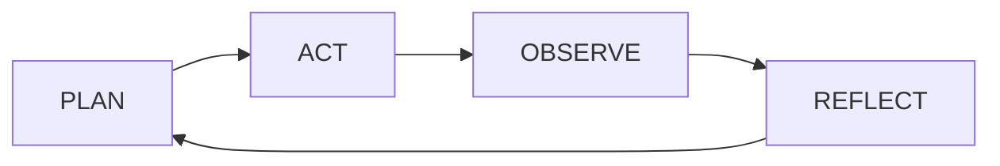

<Eyebrow>Keynote · 2026</Eyebrow>

# 关于 Agent 你还不知道的事

循环、脚手架、上下文、记忆：在生产环境里真正起作用的是什么。

kami slides demo · 16:9 · 6 slides

---
layout: section
---

<Eyebrow>01 · Agent Loop</Eyebrow>

## 内核很小，周边很复杂

循环本身很小。真正让它在功能增长时保持稳定的，是**围绕它的基础设施**。

1. 一个能跑的 Agent 循环大约 20 行代码。
2. 控制流住在工具里，而不是分支丛生的内部状态。
3. Workflow 与 Agent 的差别：代码里预定义路径，还是模型在运行时挑路径。

> 如果你的循环每个迭代都在变长，你修的是错的那一层。税是在循环*外面*付的。

---
layout: default
---

### 组件验收

<Badge>Ink Blue</Badge>

<Callout title="信息" type="info">
默认的 callout：ivory 填充 + 2.5px 墨蓝左竖线，没有闭合边框，没有硬阴影。
</Callout>

<Callout title="警示" type="warn">
warning 复用 Kami 自己的 `--breaking-fg`（#8b4513），不引入第二个饱和色。
</Callout>

<Callout title="通过" type="success">
success 用去饱和的暖绿，在羊皮纸上不跳。
</Callout>

<KeyStat value="20" label="Lines of code" detail="一个可用的 Agent 循环的规模" />

---
layout: statement
---

## 内容优先，装饰归零

<PullQuote by="Kami" meta="design.md">
墨蓝覆盖不超过文档表面的 5%。超过这个数，那就是装饰，而不是克制。
</PullQuote>

---
layout: default
---

### 表格与代码

| 层级 | 字号 | 字重 | 行高 |
| --- | --- | --- | --- |
| Display | 36pt | 500 | 1.10 |
| H1 Section | 22pt | 500 | 1.20 |
| Body | 10pt | 400 | 1.55 |

```ts
// 注释应当多于代码：读者看到的是逻辑，不是语法。
async function loop(goal: string) {
  while (!done(goal)) {
    const plan = await model.plan(goal)
    await tools.run(plan)
  }
}
```

行内代码 `--brand: #1B365D` 与[链接](https://kami.tw93.fun)。

---
layout: chapter
---

<Eyebrow>02</Eyebrow>

# 图表与示意


