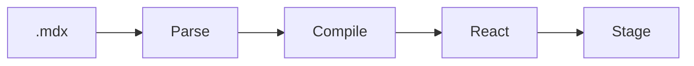
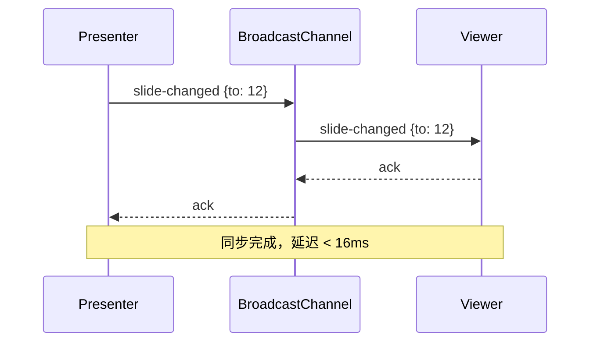
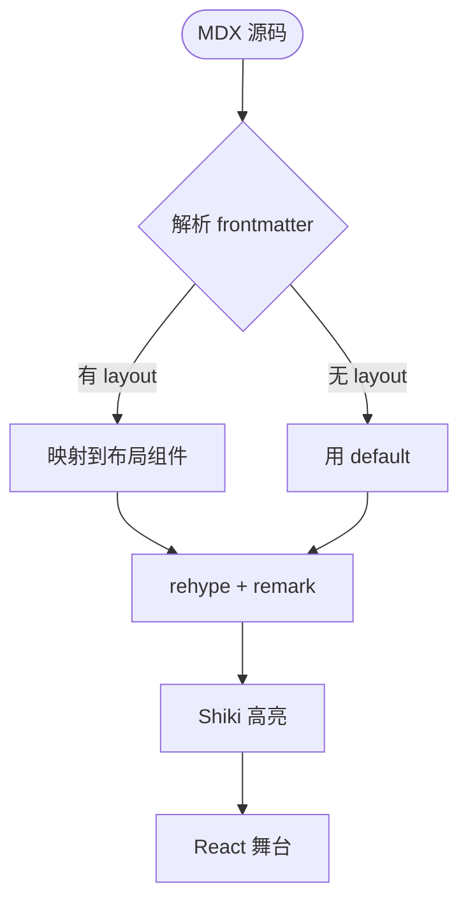
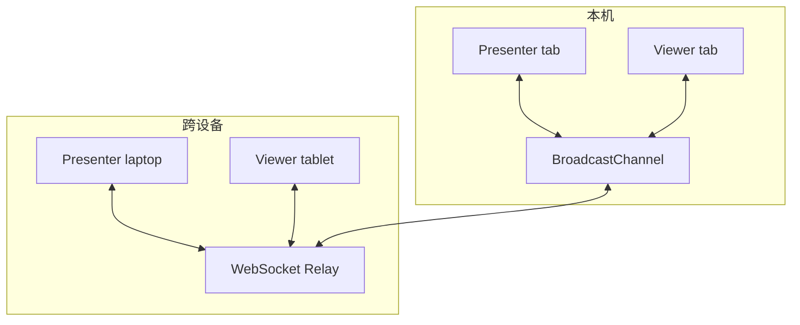
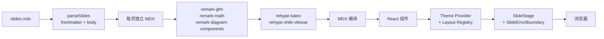

---
title: "slidev-react · 肌肉秀"
layout: cover
notes: |
  封面。一句话定义这个项目：MDX 进，React 出，幻灯片编译出来。不是 Slidev 的 React 克隆，是 React-native 的演讲运行时。
---

<CourseCover
  color="green"
  tone="light"
  lesson="01"
  total="01"
  series="slidev-react · 肌肉秀"
  title="MDX in. React out."
  subtitle="一份 .mdx 文件，编译成一整套现代演讲运行时。"
  author="hylarucoder"
/>

---
title: 你的下一份演示不是 PPT
layout: statement
transition: fade
notes: |
  第一幕开场。用 statement 布局让这句话顶到视觉中央。
  要点：别把 slidev-react 当"Markdown 版 PPT"卖，它是一个 React 应用，只是 deck 是它的入口。
---

# 你的下一份演示<br/>不是 PPT

### 它是一个 <Annotate type="circle">React 应用</Annotate>

---
title: 授权模型 · 四条规则
layout: default
notes: |
  讲清授权模型的四条规则。左源码、右解释，让读者 10 秒看懂写 deck 要做什么。
---

# 授权模型 · 四条规则

<div className="grid gap-6 md:grid-cols-2">
<div>

```mdx
---
title: slidev-react · 肌肉秀
addons: [mermaid, g2, insight]
---

---
title: Hello
layout: cover
---

# 大字标题

<Callout>这是 React 组件。</Callout>
```

</div>
<div>

1. Deck 首部 frontmatter 定义**全局元数据**
2. `---` 开启下一页
3. 每页可有**自己的 frontmatter**
4. 正文是 MDX + 仓库内置 React 组件

<Insight title="关键洞察">
deck 作者只学 MDX 语法；运行时由 React 独立掌管 — 皮肤、动效、演讲模式互不干扰。
</Insight>

</div>
</div>

---
title: 解剖一页幻灯片
layout: default
notes: |
  Anatomy 页。左是源码，右是渲染结果。用 Annotate 圈出 frontmatter / 组件 / reveal 三个要点。
  这页本身就在用它讲的能力 — dogfooding。
---

# 解剖一页幻灯片

<div className="grid gap-6 md:grid-cols-2">
<div>

```mdx
---
title: 示例页
layout: two-cols
class: px-16
transition: slide-left
---

# 左栏

<Step step={1}>现场点一下揭示。</Step>

<hr />

# 右栏

<Badge>MDX</Badge>
```

</div>
<div className="space-y-5">

<p>上方源码拆成三层：</p>

<ul>
  <li><Annotate type="box">frontmatter</Annotate>：选布局、挂 class、指定转场。</li>
  <li><Annotate type="underline">React 组件</Annotate>：`Step` / `Badge` 不需要 import。</li>
  <li><Annotate type="circle">`<hr />`</Annotate>：两栏布局里的栏位分隔。</li>
</ul>

<Callout type="info" title="别写 `---`">
两栏/图右布局的栏位分隔必须用 `<hr />` — 原生 `---` 会被解析成下一页。
</Callout>

</div>
</div>

---
title: "§ 创作表面"
layout: section
notes: |
  分幕分隔页。节奏第一次切换：从立论进入"如何写"。
---

# 创作表面

---
title: 8 种布局 · 即插即用
layout: default
class: px-12
notes: |
  8 个内置布局列出来。每个布局卡片用最小样式示意，底部点名"addon 还能贡献更多"。
---

# 8 种布局 · 即插即用

<div className="mt-6 grid gap-4 md:grid-cols-4">

  <div className="rounded-[6px] border p-4" style={{ borderColor: "var(--slide-ui-border)", background: "var(--slide-ui-surface-strong)" }}>
    <strong className="block text-xs uppercase tracking-wider" style={{ color: "var(--slide-ui-accent)" }}>default</strong>
    <p className="mt-2 text-sm" style={{ color: "var(--slide-ui-muted)" }}>通用正文页，标题 + 正文。</p>
  </div>

  <div className="rounded-[6px] border p-4" style={{ borderColor: "var(--slide-ui-border)", background: "var(--slide-ui-surface-strong)" }}>
    <strong className="block text-xs uppercase tracking-wider" style={{ color: "var(--slide-ui-accent)" }}>center</strong>
    <p className="mt-2 text-sm" style={{ color: "var(--slide-ui-muted)" }}>居中，焦点或结语。</p>
  </div>

  <div className="rounded-[6px] border p-4" style={{ borderColor: "var(--slide-ui-border)", background: "var(--slide-ui-surface-strong)" }}>
    <strong className="block text-xs uppercase tracking-wider" style={{ color: "var(--slide-ui-accent)" }}>cover</strong>
    <p className="mt-2 text-sm" style={{ color: "var(--slide-ui-muted)" }}>封面，主标题 + 副标题。</p>
  </div>

  <div className="rounded-[6px] border p-4" style={{ borderColor: "var(--slide-ui-border)", background: "var(--slide-ui-surface-strong)" }}>
    <strong className="block text-xs uppercase tracking-wider" style={{ color: "var(--slide-ui-accent)" }}>section</strong>
    <p className="mt-2 text-sm" style={{ color: "var(--slide-ui-muted)" }}>分幕分隔，节奏切换。</p>
  </div>

  <div className="rounded-[6px] border p-4" style={{ borderColor: "var(--slide-ui-border)", background: "var(--slide-ui-surface-strong)" }}>
    <strong className="block text-xs uppercase tracking-wider" style={{ color: "var(--slide-ui-accent)" }}>immersive</strong>
    <p className="mt-2 text-sm" style={{ color: "var(--slide-ui-muted)" }}>满屏沉浸，背景铺满。</p>
  </div>

  <div className="rounded-[6px] border p-4" style={{ borderColor: "var(--slide-ui-border)", background: "var(--slide-ui-surface-strong)" }}>
    <strong className="block text-xs uppercase tracking-wider" style={{ color: "var(--slide-ui-accent)" }}>two-cols</strong>
    <p className="mt-2 text-sm" style={{ color: "var(--slide-ui-muted)" }}>左右双栏，对照讲解。</p>
  </div>

  <div className="rounded-[6px] border p-4" style={{ borderColor: "var(--slide-ui-border)", background: "var(--slide-ui-surface-strong)" }}>
    <strong className="block text-xs uppercase tracking-wider" style={{ color: "var(--slide-ui-accent)" }}>image-right</strong>
    <p className="mt-2 text-sm" style={{ color: "var(--slide-ui-muted)" }}>左文右图，配图讲解。</p>
  </div>

  <div className="rounded-[6px] border p-4" style={{ borderColor: "var(--slide-ui-border)", background: "var(--slide-ui-surface-strong)" }}>
    <strong className="block text-xs uppercase tracking-wider" style={{ color: "var(--slide-ui-accent)" }}>statement</strong>
    <p className="mt-2 text-sm" style={{ color: "var(--slide-ui-muted)" }}>大字宣言，情绪峰值。</p>
  </div>

</div>

<Callout type="info" title="Addon 还能加">
`insight` addon 注册了 `spotlight` 布局 — 任何 addon 都能贡献自己的布局。
</Callout>

---
title: 主题引擎 · Token 即设计
layout: default
notes: |
  默认主题的 token 体系。把内置 token 直接列出来，证明主题不是"一张皮"，是一组有结构的 CSS variable。
  实际从 packages/client/src/theme/tokens.css 拷贝的真实 token 名。
---

# 主题引擎 · Token 即设计

<div className="grid gap-6 md:grid-cols-2">
<div>

**4 族 token · 全局协调**

```css
/* UI 主色域 */
--slide-ui-background: #ffffff;
--slide-ui-text: #0f172a;
--slide-ui-accent: #22c55e;
--slide-ui-border: rgba(15, 23, 42, 0.09);

/* 图表色板 */
--slide-chart-category-1: #60a5fa;
--slide-chart-category-2: #34d399;
--slide-chart-positive: #22c55e;
--slide-chart-negative: #ef4444;

/* 图形/图表说明 */
--slide-diagram-primary: #dcfce7;
--slide-diagram-line: #334155;

/* Insight 组件 */
--slide-insight-title: #155e75;
--slide-insight-bg: rgba(236, 254, 255, 0.88);
```

</div>
<div>

**排版也是 token**

```css
--slide-h1-size: clamp(3rem, 5.9vw, 5.2rem);
--slide-h1-weight: 850;
--slide-h1-letter-spacing: -0.03em;

--slide-p-font-size: clamp(1.52rem, 1.92vw, 2.08rem);
--slide-p-line-height: 1.64;

--font-sans: "Inter", "PingFang SC", ...;
--font-mono: "JetBrains Mono", ...;
```

<Insight title="为什么 clamp">
字号全部走 `clamp(min, vw, max)` — 同一份 deck 投 4K 投影仪和 1080p 会议屏都能自适应，不会爆字。
</Insight>

</div>
</div>

---
title: 代码高亮 · Shiki 编译时渲染
layout: default
notes: |
  Shiki + vitesse-light 主题在编译期完成高亮。运行时零开销，HTML 直出。
  MDX 管线在 packages/node/src/slides/compiling/rehypeShikiVitesse.ts。
---

# 代码高亮 · 编译时 Shiki

<div className="grid gap-6 md:grid-cols-2">
<div>

```tsx
import { useState } from 'react'

export function CounterCard() {
  const [count, setCount] = useState(0)

  return (
    <button onClick={() => setCount(count + 1)}>
      count: {count}
    </button>
  )
}
```

</div>
<div>

```python
def fibonacci(n: int) -> int:
    if n < 2:
        return n
    a, b = 0, 1
    for _ in range(n - 1):
        a, b = b, a + b
    return b
```

```bash
pnpm slidev-react dev
pnpm slidev-react export --format pdf
```

</div>
</div>

<Callout type="success" title="零运行时开销">
代码全部在 `vite` 构建时由 Shiki 转成静态 HTML — 播放 deck 时浏览器只做渲染，不加载任何语法高亮 JS。
</Callout>

---
title: Magic Move · 讲一段重构故事
layout: default
notes: |
  这页不是 magic move 的语法演示，是一个微型重构故事：
  useState 双值 → useReducer → 抽成自定义 hook。
  让代码动起来讲话。
---

# Magic Move · 一段重构故事

“双 `useState` → `useReducer` → 抽成 hook”。

<CodeMagicMove steps={[
  `function Counter() {\n  const [count, setCount] = useState(0)\n  const [history, setHistory] = useState([])\n\n  function increment() {\n    setHistory([...history, count])\n    setCount(count + 1)\n  }\n\n  return <button onClick={increment}>{count}</button>\n}`,
  `function reducer(state, action) {\n  if (action.type === 'inc') {\n    return {\n      count: state.count + 1,\n      history: [...state.history, state.count],\n    }\n  }\n  return state\n}\n\nfunction Counter() {\n  const [state, dispatch] = useReducer(reducer, {\n    count: 0,\n    history: [],\n  })\n\n  return <button onClick={() => dispatch({ type: 'inc' })}>{state.count}</button>\n}`,
  `function useCounterWithHistory() {\n  const [state, dispatch] = useReducer(reducer, {\n    count: 0,\n    history: [],\n  })\n\n  return {\n    count: state.count,\n    history: state.history,\n    increment: () => dispatch({ type: 'inc' }),\n  }\n}\n\nfunction Counter() {\n  const { count, increment } = useCounterWithHistory()\n  return <button onClick={increment}>{count}</button>\n}`,
]} />

---
title: 数学 × 图表 × 代码 · 一页同屏
layout: default
notes: |
  把 LaTeX、mermaid、代码三种异构内容放同一页，证明它们互不打架。
  数学用 remark-math + rehype-katex，mermaid 用 addon。
---

# 数学 × 图表 × 代码 · 同屏共演

<div className="grid gap-5 md:grid-cols-3">
<div>

**LaTeX**

$$
\begin{aligned}
\nabla \cdot \vec{E} &= \frac{\rho}{\varepsilon_0} \\
\nabla \times \vec{B} &= \mu_0\vec{J}
\end{aligned}
$$

行内：$e^{i\pi}+1=0$

</div>
<div>

**Mermaid**



</div>
<div>

**TypeScript**

```ts
type Slide = {
  id: string
  layout: string
  source: string
}
```

</div>
</div>

<Callout type="info" title="一条管线三种产出">
`remark-math + rehype-katex + rehype-shiki + remark-diagram-components` 串行处理同一棵 MDX AST，互不干扰。
</Callout>

---
title: "§ 内容密度"
layout: section
notes: |
  进入图表密集幕。一口气打两页图表，是秀肌肉里的"堆料"位。
---

# 内容密度

---
title: 图表基本款 · 四合一
layout: default
notes: |
  Bar / Line / Pie / Area — 覆盖 80% 商务场景。
  这页是"基础但全"的证据。
---

# 图表基本款 · 四合一

<div className="grid grid-cols-2 gap-4">
<div>

**BarChart**

<BarChart
  width={620}
  height={240}
  data={[
    { genre: "Sports", sold: 275 },
    { genre: "Strategy", sold: 115 },
    { genre: "Action", sold: 120 },
    { genre: "Shooter", sold: 350 },
    { genre: "RPG", sold: 180 },
    { genre: "Other", sold: 150 },
  ]}
  x="genre"
  y="sold"
  color="genre"
/>

</div>
<div>

**LineChart**

<LineChart
  width={620}
  height={240}
  data={[
    { month: "Jan", revenue: 4200 },
    { month: "Feb", revenue: 3800 },
    { month: "Mar", revenue: 5100 },
    { month: "Apr", revenue: 4700 },
    { month: "May", revenue: 6200 },
    { month: "Jun", revenue: 7800 },
    { month: "Jul", revenue: 9100 },
    { month: "Aug", revenue: 8600 },
    { month: "Sep", revenue: 10200 },
    { month: "Oct", revenue: 11800 },
    { month: "Nov", revenue: 12400 },
    { month: "Dec", revenue: 14200 },
  ]}
  x="month"
  y="revenue"
/>

</div>
<div>

**PieChart (donut)**

<PieChart
  width={620}
  height={240}
  data={[
    { brand: "Apple", share: 35 },
    { brand: "Samsung", share: 25 },
    { brand: "Xiaomi", share: 15 },
    { brand: "Huawei", share: 12 },
    { brand: "Other", share: 13 },
  ]}
  value="share"
  label="brand"
  donut
/>

</div>
<div>

**AreaChart (stacked)**

<AreaChart
  width={620}
  height={240}
  data={[
    { month: "Jan", users: 1200, channel: "Organic" },
    { month: "Feb", users: 1800, channel: "Organic" },
    { month: "Mar", users: 2400, channel: "Organic" },
    { month: "Apr", users: 3200, channel: "Organic" },
    { month: "May", users: 4100, channel: "Organic" },
    { month: "Jun", users: 5000, channel: "Organic" },
    { month: "Jan", users: 800, channel: "Paid" },
    { month: "Feb", users: 1200, channel: "Paid" },
    { month: "Mar", users: 1600, channel: "Paid" },
    { month: "Apr", users: 2000, channel: "Paid" },
    { month: "May", users: 2800, channel: "Paid" },
    { month: "Jun", users: 3500, channel: "Paid" },
  ]}
  x="month"
  y="users"
  color="channel"
  stack
/>

</div>
</div>

---
title: 图表高阶款 · 六合一
layout: default
notes: |
  六种相对少见但关键的图：Scatter / Radar / Heatmap / Funnel / Gauge / Liquid。
  一口气抛出去，证明 G2 addon 覆盖面广。
---

# 图表高阶款 · 六合一

<div className="grid grid-cols-3 gap-3">
<div>

**Scatter**

<ScatterChart
  width={420}
  height={220}
  data={[
    { height: 170, weight: 65, gender: "Male" },
    { height: 175, weight: 72, gender: "Male" },
    { height: 180, weight: 80, gender: "Male" },
    { height: 168, weight: 68, gender: "Male" },
    { height: 182, weight: 85, gender: "Male" },
    { height: 163, weight: 55, gender: "Female" },
    { height: 158, weight: 50, gender: "Female" },
    { height: 165, weight: 58, gender: "Female" },
    { height: 170, weight: 62, gender: "Female" },
    { height: 160, weight: 52, gender: "Female" },
  ]}
  x="height"
  y="weight"
  color="gender"
/>

</div>
<div>

**Radar (area)**

<RadarChart
  width={420}
  height={220}
  data={[
    { dim: "Frontend", score: 90, team: "Alpha" },
    { dim: "Backend", score: 75, team: "Alpha" },
    { dim: "Design", score: 60, team: "Alpha" },
    { dim: "DevOps", score: 85, team: "Alpha" },
    { dim: "Testing", score: 70, team: "Alpha" },
    { dim: "Frontend", score: 65, team: "Beta" },
    { dim: "Backend", score: 90, team: "Beta" },
    { dim: "Design", score: 80, team: "Beta" },
    { dim: "DevOps", score: 55, team: "Beta" },
    { dim: "Testing", score: 85, team: "Beta" },
  ]}
  x="dim"
  y="score"
  color="team"
  area
/>

</div>
<div>

**Heatmap**

<HeatmapChart
  width={420}
  height={220}
  data={[
    { week: "Mon", hour: "9am", value: 10 },
    { week: "Mon", hour: "12pm", value: 26 },
    { week: "Mon", hour: "3pm", value: 18 },
    { week: "Tue", hour: "9am", value: 14 },
    { week: "Tue", hour: "12pm", value: 32 },
    { week: "Tue", hour: "3pm", value: 22 },
    { week: "Wed", hour: "9am", value: 20 },
    { week: "Wed", hour: "12pm", value: 28 },
    { week: "Wed", hour: "3pm", value: 30 },
    { week: "Thu", hour: "9am", value: 18 },
    { week: "Thu", hour: "12pm", value: 35 },
    { week: "Thu", hour: "3pm", value: 24 },
    { week: "Fri", hour: "9am", value: 12 },
    { week: "Fri", hour: "12pm", value: 30 },
    { week: "Fri", hour: "3pm", value: 20 },
  ]}
  x="hour"
  y="week"
  color="value"
/>

</div>
<div>

**Funnel**

<Chart
  type="interval"
  width={420}
  height={220}
  data={[
    { stage: "Visitors", count: 5000 },
    { stage: "Sign-ups", count: 3200 },
    { stage: "Trials", count: 1800 },
    { stage: "Paid", count: 950 },
    { stage: "Retained", count: 600 },
  ]}
  encode={{ x: "stage", y: "count", color: "stage", shape: "funnel" }}
  coordinate={{ transform: [{ type: "transpose" }] }}
/>

</div>
<div>

**Gauge**

<Chart
  preset="gauge"
  width={420}
  height={220}
  data={{ value: { target: 78, total: 100, name: 'Score' } }}
/>

</div>
<div>

**Liquid**

<Chart
  preset="liquid"
  width={420}
  height={220}
  data={0.72}
/>

</div>
</div>

---
title: 词云 + 箱线 · 不常见也打满
layout: default
notes: |
  用低频但强辨识度的两张图压轴：词云和箱线。
  再补一个 WordCloud 把本 deck 用到的关键词自引用一遍 — 内容即演示。
---

# 不常见图表 · 也在射程内

<div className="grid grid-cols-2 gap-5">
<div>

**WordCloud · 本 deck 关键词**

<Chart
  type="wordCloud"
  width={680}
  height={340}
  data={[
    { text: "React", value: 120 },
    { text: "MDX", value: 110 },
    { text: "Shiki", value: 85 },
    { text: "MagicMove", value: 80 },
    { text: "Reveal", value: 78 },
    { text: "Presenter", value: 72 },
    { text: "Viewer", value: 70 },
    { text: "BroadcastChannel", value: 65 },
    { text: "Annotate", value: 60 },
    { text: "Step", value: 58 },
    { text: "Steps", value: 56 },
    { text: "Layout", value: 54 },
    { text: "Addon", value: 50 },
    { text: "Moonlit", value: 48 },
    { text: "Mermaid", value: 45 },
    { text: "G2", value: 45 },
    { text: "Insight", value: 42 },
    { text: "LaTeX", value: 40 },
    { text: "Draw", value: 38 },
    { text: "Record", value: 36 },
    { text: "Export", value: 34 },
    { text: "Lint", value: 32 },
    { text: "Tokens", value: 30 },
    { text: "Transition", value: 28 },
    { text: "Motion", value: 26 },
  ]}
  encode={{ text: "text", value: "value", color: "text" }}
  legend={false}
/>

</div>
<div>

**Boxplot**

<Chart
  type="boxplot"
  width={680}
  height={340}
  data={[
    { category: "A", value: 10 }, { category: "A", value: 15 },
    { category: "A", value: 20 }, { category: "A", value: 25 },
    { category: "A", value: 30 }, { category: "A", value: 35 },
    { category: "A", value: 50 },
    { category: "B", value: 5 }, { category: "B", value: 12 },
    { category: "B", value: 18 }, { category: "B", value: 22 },
    { category: "B", value: 28 }, { category: "B", value: 40 },
    { category: "C", value: 8 }, { category: "C", value: 14 },
    { category: "C", value: 19 }, { category: "C", value: 24 },
    { category: "C", value: 32 }, { category: "C", value: 38 },
    { category: "C", value: 45 },
  ]}
  encode={{ x: "category", y: "value" }}
/>

</div>
</div>

---
title: Mermaid 图表 · 架构即内容
layout: default
notes: |
  用 mermaid 画两张 — 一张序列图、一张决策图。
  证明"一句话 diff-able 的 DSL 图"在 deck 里和 React 组件一样好用。
---

# Mermaid · 架构即内容

<div className="grid gap-6 md:grid-cols-2">
<div>

**序列图**



</div>
<div>

**决策图**



</div>
</div>

---
title: "§ 动效编排"
layout: section
notes: |
  第三幕：motion。反复强调"不是 CSS transition，是 React motion 编排"。
---

# 动效编排

---
title: Reveal 协奏 · 五种 variant 一页演
layout: default
notes: |
  一页同时用 fade-up / scale-in / slide-left / zoom / stagger，让听众看到 motion 不是单一模式。
  Step 和 Steps API 都用上。
---

# Reveal 协奏 · 一页五种 variant

<div className="grid gap-5 md:grid-cols-2">
<div>

```mdx
<Step step={1} variant="fade-up">
  第一拍：淡入上浮
</Step>

<Step step={2} variant="scale-in"
  timing={{ duration: 0.32, ease: "circOut" }}>
  第二拍：缩放浮现
</Step>

<Step step={3} variant="slide-left">
  第三拍：右侧滑入
</Step>

<ul>
  <Steps start={4}
    variant="fade-up"
    stagger={0.08}
    reserveSpace>
    <li>第四拍</li>
    <li>第五拍</li>
    <li>第六拍</li>
  </Steps>
</ul>
```

</div>
<div className="space-y-3">

<Step step={1} variant="fade-up">
  <div className="rounded-[6px] border p-3" style={{ borderColor: "var(--slide-ui-border)", background: "var(--slide-ui-surface-strong)" }}>
    <strong>① fade-up</strong> · 淡入上浮
  </div>
</Step>

<Step step={2} variant="scale-in" timing={{ duration: 0.32, ease: "circOut" }}>
  <div className="rounded-[6px] border p-3" style={{ borderColor: "var(--slide-ui-border)", background: "var(--slide-ui-surface-strong)" }}>
    <strong>② scale-in</strong> · 缩放浮现
  </div>
</Step>

<Step step={3} variant="slide-left">
  <div className="rounded-[6px] border p-3" style={{ borderColor: "var(--slide-ui-border)", background: "var(--slide-ui-surface-strong)" }}>
    <strong>③ slide-left</strong> · 右侧滑入
  </div>
</Step>

<ul>
  <Steps start={4} variant="fade-up" stagger={0.08} reserveSpace>
    <li>④ stagger = 0.08s</li>
    <li>⑤ 列表依次上浮</li>
    <li>⑥ reserveSpace 保留布局</li>
  </Steps>
</ul>

</div>
</div>

---
title: Annotate 五型 · 临场标记
layout: default
notes: |
  5 种 Annotate 同屏 + 配 Step 依次激活。像打字机一样"念到哪里标到哪里"。
---

# Annotate · 五型标记

<div className="mt-8 space-y-5 text-lg">

<p>
  默认样式用 <Annotate step={1}>高亮主题词</Annotate>，
  讲到关键概念时 <Annotate type="underline" step={2}>划线强调</Annotate>，
  或 <Annotate type="box" step={3}>框出 API 边界</Annotate>。
</p>

<p>
  时间点到了，<Annotate type="circle" step={4}>圈出上线节点</Annotate>；
  弃用路径则 <Annotate type="strike-through" step={5}>划掉这条旧做法</Annotate>。
</p>

<p className="text-sm" style={{ color: "var(--slide-ui-muted)" }}>
  按空格逐个激活：5 种标记完整演绎一次。给 <code>animate={`{false}`}</code> 可以立刻出现、不绘制动画。
</p>

</div>

<Insight title="为什么自己造轮子">
现有的 Rough Notation 是命令式 + 全局副作用，不适合 React 组件模型。`Annotate` 把它重做成了声明式、接入 Reveal 系统的 React 组件。
</Insight>

---
title: 转场 · 四种 + reduced-motion
layout: default
transition: slide-up
notes: |
  四种转场用表格列出来。底部强调响应 prefers-reduced-motion。
  这一页 frontmatter 本身用 slide-up 作为示例。
---

# 转场 · 四种 + reduced-motion

<div className="grid gap-6 md:grid-cols-2">
<div>

| Transition | 视觉 |
| --- | --- |
| `fade` | 透明度交叉淡化 |
| `slide-left` | 从右滑入 + 淡入 |
| `slide-up` | 从下上浮 + 淡入 |
| `zoom` | 96% 缩放放大 + 淡入 |

```yaml
---
title: My Slide
transition: slide-up
---
```

</div>
<div>

<Callout type="info" title="尊重系统偏好">
检测到 `prefers-reduced-motion: reduce` 时**所有**转场自动降级为瞬切 — 无需作者关心。
</Callout>

<Insight title="Motion 引擎">
转场不是 CSS `transition`，是 `motion` 驱动的 scene 切换 — 和 Step 内的 variant 共用同一套编排系统。
</Insight>

</div>
</div>

---
title: Dogfooding · 本页自证
layout: default
notes: |
  元页：这一页用 Annotate + Step 讲"如何用 Annotate + Step"。
  自举到让听众无法否认。
---

# 本页正在用<br/>它自己讲的能力

<div className="mt-6 space-y-5 text-lg">

<Step step={1} variant="fade-up">
  <p>
    第 1 拍揭示：<Annotate type="underline">这句话</Annotate> 的下划线就是 `Annotate`。
  </p>
</Step>

<Step step={2} variant="scale-in">
  <p>
    第 2 拍揭示：<Annotate type="box">这个方框</Annotate> 和讲 API 时的强调一模一样。
  </p>
</Step>

<Step step={3} variant="slide-left">
  <p>
    第 3 拍揭示：<Annotate type="circle">这个圆圈</Annotate> 能当"打卡"用。
  </p>
</Step>

<Step step={4} variant="fade-up">
  <Insight title="自指证明">
    如果你能看到这段 Insight 浮现，说明：Step / Annotate / Insight / Reveal 流水线 / MDX 组件注入，全都在工作。
  </Insight>
</Step>

</div>

---
title: "§ 演讲现场"
layout: section
notes: |
  进入 live 能力幕。
---

# 演讲现场

---
title: 双端运行时 · Presenter ↔ Viewer
layout: default
notes: |
  用 mermaid 画两端同步的全链路：BroadcastChannel 走本机、WebSocket 走跨设备。
  游标同步也是同一条通道。
---

# 双端运行时 · 同步不只是换页

<div className="grid gap-6 md:grid-cols-2">
<div>



</div>
<div>

**同步的不止是当前页：**

- 当前 slide index
- Reveal step 进度
- Presenter 鼠标轨迹（游标同步）
- Drawing strokes（per-slide 持久化）
- 记录状态（是否在录制）

```bash
# 启动跨设备 relay
pnpm presentation:server

# 本机多 tab：无需启动任何服务
# BroadcastChannel 在同源下免配置
```

<Insight title="多 tab 免配置">
只要演示机上 Presenter 和 Viewer 同源，BroadcastChannel 零代码、零配置即可互通。
</Insight>

</div>
</div>

---
title: 绘制模式 · 临场标注
layout: default
notes: |
  Draw arsenal。左是快捷键矩阵，右是持久化和工作原理。
---

# 绘制模式 · 临场标注

<div className="grid gap-6 md:grid-cols-2">
<div>

**工具快捷键**

| Key | 工具 |
| --- | --- |
| `D` | 切换绘制模式 |
| `P` | 画笔 |
| `B` | 圆形 |
| `R` | 矩形 |
| `E` | 橡皮 |
| `C` | 清空当前页 |
| `⌘/Ctrl + Z` | 撤销 |

</div>
<div>

**持久化与隔离**

- SVG 覆盖层，零 canvas 依赖
- 每页 strokes 独立存 `localStorage`
- 页面刷新、重新进入 deck 后仍保留
- **仅 Presenter 模式可绘**，Viewer 只读展示

```ts
// 持久化 key 结构
`slidev-react:draw:${deckId}:${slideIndex}`
```

<Insight title="为什么是 SVG 不是 Canvas">
SVG 支持 vector undo、可缩放、可导出 — 对讲稿场景比位图 Canvas 更合适。
</Insight>

</div>
</div>

---
title: 三大 Overlay · O · N · ?
layout: default
notes: |
  Quick Overview / Notes Workspace / Shortcuts Help — 三个 overlay 一起讲。
  都在 packages/client/src/features/presentation/navigation/ 和 overview/ 下面。
---

# 三大 Overlay · 一键唤起

<div className="grid gap-5 md:grid-cols-3">

<div className="rounded-[6px] border p-5" style={{ borderColor: "var(--slide-ui-border)", background: "var(--slide-ui-surface-strong)" }}>
  <div className="text-xs uppercase tracking-wider" style={{ color: "var(--slide-ui-accent)" }}>按 `O`</div>
  <h3 className="mt-2 text-lg font-semibold">Quick Overview</h3>
  <p className="mt-2 text-sm" style={{ color: "var(--slide-ui-muted)" }}>
    活缩略图网格。每个 cell 是一份迷你 SlidePreviewSurface，点击即跳转。
  </p>
  <ul className="mt-3 text-sm">
    <li>· 页码 + layout 标签</li>
    <li>· 当前页 emerald ring 高亮</li>
    <li>· `Esc` 关闭</li>
  </ul>
</div>

<div className="rounded-[6px] border p-5" style={{ borderColor: "var(--slide-ui-border)", background: "var(--slide-ui-surface-strong)" }}>
  <div className="text-xs uppercase tracking-wider" style={{ color: "var(--slide-ui-accent)" }}>按 `N`</div>
  <h3 className="mt-2 text-lg font-semibold">Notes Workspace</h3>
  <p className="mt-2 text-sm" style={{ color: "var(--slide-ui-muted)" }}>
    滚动式讲稿面板。所有带 `notes:` 的页同屏可读。
  </p>
  <ul className="mt-3 text-sm">
    <li>· 左缩略图 · 右讲稿</li>
    <li>· 彩排/复盘神器</li>
    <li>· **仅 Presenter**</li>
  </ul>
</div>

<div className="rounded-[6px] border p-5" style={{ borderColor: "var(--slide-ui-border)", background: "var(--slide-ui-surface-strong)" }}>
  <div className="text-xs uppercase tracking-wider" style={{ color: "var(--slide-ui-accent)" }}>按 `?` / 双击 Shift</div>
  <h3 className="mt-2 text-lg font-semibold">Shortcuts Help</h3>
  <p className="mt-2 text-sm" style={{ color: "var(--slide-ui-muted)" }}>
    **上下文感知**快捷键面板。Draw 组快捷键只在 Presenter 模式出现。
  </p>
  <ul className="mt-3 text-sm">
    <li>· 动态按上下文构建</li>
    <li>· 双击 Shift 也能唤起</li>
    <li>· `Esc` 关闭</li>
  </ul>
</div>

</div>

<Callout type="info" title="Overlay 也是 React 组件">
三个 overlay 共用同一层 Portal + focus trap — 彼此互斥、唯一焦点、Esc 关闭行为一致。
</Callout>

---
title: 一键录制 · 浏览器原生
layout: default
notes: |
  Recording 流程。强调"纯前端、无额外运行时"。文件名从 deck title 生成。
---

# 一键录制 · 浏览器原生

<div className="grid gap-6 md:grid-cols-2">
<div>

**四步录一份 WebM**

<Steps start={1} variant="fade-up" stagger={0.08} reserveSpace>
  <div>① 点 Presenter 工具条的 **Record** 按钮</div>
  <div>② 浏览器弹出屏幕共享选择</div>
  <div>③ 像平时一样讲 deck，计时在顶部显示</div>
  <div>④ 停止 — WebM 自动下载，文件名源自 deck 标题</div>
</Steps>

</div>
<div>

**技术栈**

```ts
// 核心 API
navigator.mediaDevices.getDisplayMedia()
new MediaRecorder(stream, {
  mimeType: 'video/webm;codecs=vp9,opus',
})

// 回退链：
// VP9/Opus → VP8 → 裸 WebM
```

<Insight title="零服务端依赖">
整条录制链路在浏览器内完成 — 不需要 FFmpeg、不需要任何后端。分享的 deck 链接就能录。
</Insight>

</div>
</div>

---
title: 单页崩溃隔离
layout: default
notes: |
  SlideErrorBoundary — 单页组件报错不会炸掉整个 deck。
  这是一个容易被忽视但在讲稿现场非常关键的能力。
---

# 单页崩溃隔离 · 讲稿不会黑屏

<div className="grid gap-6 md:grid-cols-2">
<div>

**每页包一层 `ErrorBoundary`**

```tsx
class SlideErrorBoundary extends Component {
  static getDerivedStateFromError(error) {
    return { error }
  }

  componentDidUpdate(prev) {
    // 切换页面时 resetKey 变化，
    // 自动清掉上一页的错误
    if (prev.resetKey === this.props.resetKey) return
    if (!this.state.error) return
    this.setState({ error: null })
  }
}
```

</div>
<div>

**出错时的视觉协议**

- 红色告警区块就地显示
- 页码 / 标题保留
- 错误 message 以等宽字体展示
- 切到下一页自动复位
- 其他 47 页**照常工作**

<Callout type="success" title="演讲者保命机制">
临场一页的 React 渲染崩了，观众最多看到一格红色提示 — 你继续按 `→` 就过去了。
</Callout>

</div>
</div>

---
title: "§ 工程内核"
layout: section
notes: |
  最后一幕：DX / 编译管线 / CLI。
---

# 工程内核

---
title: MDX 编译流水线
layout: default
notes: |
  用 mermaid 画一下从 .mdx 到 React 组件的完整 pipeline。
  这是最能体现"不是玩具"的一页。
---

# MDX 编译流水线



<div className="mt-6 grid gap-4 md:grid-cols-3 text-sm">
  <div className="rounded-[6px] border p-3" style={{ borderColor: "var(--slide-ui-border)" }}>
    <strong>编译时</strong><br/>frontmatter / 代码高亮 / 数学公式
  </div>
  <div className="rounded-[6px] border p-3" style={{ borderColor: "var(--slide-ui-border)" }}>
    <strong>装配时</strong><br/>布局解析 / Addon 注入 / Provider 嵌套
  </div>
  <div className="rounded-[6px] border p-3" style={{ borderColor: "var(--slide-ui-border)" }}>
    <strong>运行时</strong><br/>Reveal / Motion / 双端 Sync
  </div>
</div>

---
title: Addon 合约 · 6 行注册一个插件
layout: default
notes: |
  贴真实的 SlideAddonDefinition 接口。
  右侧用 Insight 组件作为"addon 活着的证据" — dogfood 到 meta 层。
---

# Addon 合约 · 6 行一个插件

<div className="grid gap-6 md:grid-cols-2">
<div>

```ts
// packages/core/src/addon/types.ts
export interface SlideAddonDefinition {
  id: string
  label: string
  experimental?: boolean
  provider?: AddonProviderComponent
  layoutIds?: string[]
  layouts?: LayoutRegistry
  mdxComponents?: ThemeMDXComponents
}
```

```ts
// 真实例子：insight addon
export const addon = defineAddon({
  id: "insight",
  label: "Insight",
  provider: InsightAddonProvider,
  layouts: { spotlight: SpotlightLayout },
  mdxComponents: { Insight },
})
```

</div>
<div>

<Insight title="这段话就是 addon 渲染的">
右边这个 Insight 容器来自 `insight` addon 的 `mdxComponents.Insight` — 把 addon 声明到 deck frontmatter 后，`<Insight>` 在每一页都能直接用，不需要 import。
</Insight>

**3 个内置 addon：**

```yaml
---
addons:
  - mermaid   # 图表语法支持
  - g2        # 所有图表组件
  - insight   # 洞察块 + spotlight 布局
---
```

</div>
</div>

---
title: CLI · 一个命令四个角色
layout: default
notes: |
  4 个 CLI 命令一页列完：dev / build / export / lint。
  每个都给几个常用参数作为"真的能用"的证据。
---

# CLI · 一个命令四个角色

<div className="grid gap-5 md:grid-cols-2">
<div>

**`dev` · 开发**

```bash
pnpm slidev-react dev
# HMR、frontmatter 热更、Addon 热插拔
```

**`build` · 生产构建**

```bash
pnpm slidev-react build
# 静态产物 → Vercel / 自托管
```

</div>
<div>

**`export` · 导出**

```bash
# 默认 PDF
pnpm slidev-react export

# PNG 逐页
pnpm slidev-react export --format png

# 展开 reveal 每一步
pnpm slidev-react export --with-clicks

# 选择性导出
pnpm slidev-react export --slides 1,3,5-8
```

**`lint` · 校验**

```bash
pnpm slidev-react lint
pnpm slidev-react lint --strict
```

</div>
</div>

<Callout type="info" title="export 的前置">
第一次导出前跑 `pnpm test:e2e:install` 装 Chromium — Playwright 用它渲染每一页。
</Callout>

---
title: Lint · 让 deck 也能 CI
layout: default
notes: |
  Lint 检查清单。重点是 --strict 可以接入 CI。
  validation 在 packages/node/src/slides/validation/validateSlidesAuthoring.ts。
---

# Lint · 让 deck 也能上 CI

<div className="grid gap-6 md:grid-cols-2">
<div>

**检查项**

- Frontmatter 字段合法性
- `layout` 指向是否存在
- Addon 组件引用是否注册
- Slide 结构（分隔、标题）
- 两栏布局 `<hr />` vs `---` 误用

```bash
# 普通模式：警告不阻塞
pnpm slidev-react lint

# 严格模式：任何警告 → 非零退出
pnpm slidev-react lint --strict

# 指定源文件
pnpm slidev-react lint \
  --slides decks/2024-kickoff.mdx
```

</div>
<div>

**CI 集成示例**

```yaml
# .github/workflows/deck.yml
name: deck
on: [pull_request]
jobs:
  lint:
    runs-on: ubuntu-latest
    steps:
      - uses: actions/checkout@v4
      - uses: pnpm/action-setup@v3
      - run: pnpm install
      - run: pnpm slidev-react lint --strict
```

<Insight title="Lint 是 deck 的 TypeScript">
有了 `--strict` lint，改 frontmatter / 引入新 addon / 重命名 layout 的错误都能在 PR 上被挡下来 — 不用到现场演讲时才发现跑不起来。
</Insight>

</div>
</div>

---
title: 开发体验 · HMR 到 frontmatter
layout: default
notes: |
  Dev 工作流。HMR 的颗粒度一直到 frontmatter 级别。
---

# 开发体验 · 一份 MDX 一个 HMR 单元

<div className="grid gap-6 md:grid-cols-2">
<div>

**Vite HMR 的颗粒度：**

- 改一页正文 → 只该页重渲染
- 改 frontmatter → layout 热替换，位置不丢
- 改 addon / 主题 token → 实时反馈
- 改代码块内容 → Shiki 增量高亮

```bash
pnpm slidev-react dev
# → http://localhost:3000/1         # viewer
# → http://localhost:3000/presenter/1  # presenter
# → http://localhost:3000/notes/1      # notes
```

</div>
<div>

**你常用的开发者工具都生效：**

<Steps start={1} variant="fade-up" stagger={0.07} reserveSpace>
  <div>✓ React DevTools — 每一页就是一棵组件树</div>
  <div>✓ 浏览器 DevTools — 断点、Profile 都能用</div>
  <div>✓ Source Map — 错误栈直接指回 .mdx 行号</div>
  <div>✓ TypeScript — 组件 props 有完整类型</div>
  <div>✓ ESLint / Prettier — 与其他 React 代码同源</div>
</Steps>

<Insight title="演讲器的心智模型 = React 应用">
没有新运行时要学、没有新 DSL 要背。deck 和你每天写的 React 组件一样调试。
</Insight>

</div>
</div>

---
title: "§ 收束"
layout: section
notes: |
  最终幕分隔。
---

# 收束

---
title: 数字说话 · 这份 deck 用了什么
layout: default
notes: |
  自引用的统计 — 这份 deck 实际使用了多少项能力。
  数字即证据。
---

# 数字说话 · 本 deck 消耗的能力

<div className="grid gap-6 md:grid-cols-2">
<div>

<BarChart
  width={620}
  height={360}
  data={[
    { feature: "Layouts", count: 5 },
    { feature: "Built-in Components", count: 6 },
    { feature: "Chart Types", count: 12 },
    { feature: "Reveal Variants", count: 4 },
    { feature: "Transitions", count: 3 },
    { feature: "Addons", count: 3 },
    { feature: "Annotate Types", count: 5 },
  ]}
  x="feature"
  y="count"
  color="feature"
/>

</div>
<div className="space-y-4 text-lg">

<p>这 30 页 deck 一共使用了：</p>

<ul>
  <li>✅ <strong>5</strong> 种 layout（default / cover / statement / section / two-cols）</li>
  <li>✅ <strong>6</strong> 个内置组件（Callout / Badge / Annotate / Insight / Step / Steps）</li>
  <li>✅ <strong>12</strong> 种图表（Bar / Line / Pie / Area / Scatter / Radar / Heatmap / Funnel / Gauge / Liquid / WordCloud / Boxplot）</li>
  <li>✅ <strong>4</strong> 种 Reveal variant</li>
  <li>✅ <strong>3</strong> 种 slide transition</li>
  <li>✅ 全部 <strong>3</strong> 个内置 addon</li>
</ul>

<Insight title="这份 deck 就是最大的回归测试">
每次改动 slidev-react 的运行时，跑这份 deck 就能看见哪条路走不通。
</Insight>

</div>
</div>

---
title: 开始你的下一份 deck
layout: statement
class: text-center
transition: zoom
notes: |
  结语。一句话 + CTA + 提示打开 presenter 模式。
---

# 一份 `.mdx`<br/>一条命令<br/><Annotate type="underline">全部能力</Annotate>

```bash
pnpm create slidev-react
```

<p className="mt-8 text-xl" style={{ color: "var(--slide-ui-muted)" }}>
  打开 <code>/presenter/1</code> 进入演讲者模式 · 按 <code>?</code> 看快捷键
</p>
